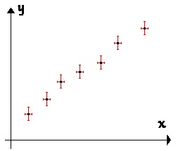

---
jupytext:
  formats: ipynb,md:myst
  split_at_heading: true
  text_representation:
    extension: .md
    format_name: myst
    format_version: 0.13
    jupytext_version: 1.10.3
kernelspec:
  display_name: Python 3
  language: python
  name: python3
---

Cette partie va présenter :
1. Le vocabulaire relatif à la métrologie qui sera utilisé.
2. Les points principaux concernant la mise en place d'un protocole, d'un compte-rendu d'observation et des méthodes d'exploitation des résultats obtenus

+++

# Vocabulaire et étapes : Généralités

## Vocabulaire

+++

### Généralités

Le terme de _mesure_ est trop imprécis, on doit donc définir des termes différents suivant les concepts envisagés :

* __Grandeur (mesurable)__ : propriété d’un phénomène, d’un corps ou d'une substance, que l'on peut exprimer quantitativement sous forme d'un nombre et d’une référence (unité de mesure principalement).
* __Mesurage, mesurande, procédure de mesure__ : Le _mesurage_ est le processus consistant à obtenir expérimentalement une ou plusieurs valeurs que l’on peut raisonnablement attribuer à une grandeur. La grandeur que l’on veut mesurer est un _mesurande_ et le processus est décrit par une _procédure de mesure_ (ou procédure/mode opératoire).
* __Résultat de mesurage__ : Ensemble de valeurs attribuées à un mesurage.

+++

```{important}
On distinguera :
> * Les mesurandes __directs__ obtenus à la lecture d'un instrument de mesure ou donnés par un constructeur d'instruments
> * Les mesurandes __indirects__ obtenus par le calcul à partir des mesurandes directs.
```

+++

### Etapes d'une manipulation
On distingue trois étapes lors d'une manipulation et du compte-rendu de celle-ci:
1. Le __protocole__ qui décrit le but de la manipulation et la méthode pour y arriver.
2. La réalisation du protocole et les __observations__ dont on rend compte, souvent au moyen de mesures quantitatives (et leur incertitudes).
3. L'__exploitation__ des observations précédentes pour répondre à la problématique posée.

+++

## Mettre en place un protocole.

+++

### Généralités
```{important}
La mise en place d'un protocole dépend beaucoup du domaine étudiée. On va se contenter ici de présenter les éléments clés d'un compte-rendu à savoir :
1. Déterminer le __but__ de la manipulation (Que veut-on obtenir ?)
2. Choisir le __principe__ de mesure (Sur quelle idée _théorique_ va-t-on baser notre manipulation ?)
3. Elaborer le __mode opératoire__ (Quelle sont les successions d'étape à réaliser pour mettre en _pratique_ le principe de mesure et atteindre le but recherché).
```

Une fois qu'on a réfléchi à ces trois points, le compte-rendu du protocole en fera la synthèse où apparaîtront les trois éléments (_but, principe, mode op_).

+++

### Un exemple
> On veut mesurer l'intensité du champ de pesanteur. Le matériel à disposition est:
> * des billes de différents diamètres
> * une règle graduée
> * un éléctro-aimant permettant de lâcher la bille au moment voulu
> * une caméra rapide et un système de traitement vidéo permettant de déterminer la position de la bille sur une image.
> * un logiciel de traitement (tableur, script python...)
> 

#### Analyse du problème
> _Il s'agit d'une analyse préalable qui ne figurera pas sur le compte-rendu._
> 1. Le __but__ est la manipulation est ici simple : mesurer l'intensité du champ de pensateur. On veut donc obtenir à la fin une estimation du mesurande $g$. Puisqu'on dispose de valeur tabulée pour comparaison, on devra estimer une incertitude de mesure _(Important d'en avoir conscience dès maintenant)_.
> 2. Le __principe__ est basé sur le matériel à disposition. Ce dernier permet ici d'étudier la chute d'une bille qu'on sait relier théoriquement au champ de pesanteur. (__Il faut donc connaître son cours théorique pour imaginer une expérience__). Ici, on a la relation :
>
> $$Z(t) = H - \frac{1}{2}g t^2$$
> 
> 3. Le __mode opératoire__ demande une connaissance du matériel à utiliser (soit c'est un matériel classique, soit une documentation est proposée) et devra être précis.
>  * Il faut bien faire la différence entre les grandeurs qu'on mesure directement et celle qu'on veut utiliser.Ici, le logiciel donnera les mesures de la position de la bille _sur l'image_ : il faudra déterminer une loi d'échelle entre le pointage et la distance réelle
>  * Il faut aussi penser à comment on utilisera les mesurandes directes pour obtenir ce qu'on veut. Ici, on disposera de nombreux couples $(t, Z)$, on pourra donc utiliser une méthode dite de régression linéaire (cf. suite) pour à la fois vérifier que le modèle théorique est valide ET déterminer $g$.
>

#### Synthèse : rédaction du compte-rendu
> _Remarque : C'est la seule partie qui apparaît dans un compte-rendu._
> __But__ : On veut déterminer l'intensité du champ de pesanteur.
> 
> __Principe__ : En déterminant les positions $Z$ d'une bille en chute libre à des instants $t$, on a la relation $Z = {gt^2 \over 2}$. On pourra donc obtenir g grâce aux couples $(Z,t)$
> 
> __Mode opératoire__ : 
> 1. On réalise le montage [ci-après](chute_libre-fig). On va lâcher la bille devant la caméra et déterminer ainsi les positions $Z$ pour plusieurs temps $t$. Une règle graduée en fond permettra de mettre l'image à l'échelle.
> 2. On peut alors représenter graphiquement $Z$ en fonction de $t^2/2$. On vérifie que l'on obtient une droite (ce qui valide le modèle théorique) puis on détermine la pente de cette droite par régression linéaire : ce sera l'intensité $g$.
> 
```{figure} ./images/chute_libre.png
---
name: chute_libre-fig
---
Schéma du montage
```

```{important}
L'utilisation d'un schéma du montage est presque __indispensable__ à chaque protocole.
```

+++

## Réalisation d'un protocole et observations.
La réalisation d'un protocole demande en général l'entraînement à l'utilisation de matériel spécifique et dépend du domaine étudié. On ne peut détailler ici chaque thème abordé dans l'année.  
Les observations qu'on est amené à réaliser sont de deux types : qualitatives (description d'un phénomène, souvent par un dessin) et quantitatives (mesure de grandeurs (directes puis indirectes).  
Lorsqu'on réalise le mesurage d'une grandeur, la valeur qu'on observe n'est pas toujours celle qu'on espère avoir (_même en réalisant correctement le mode opératoire_) et elle peut fluctuer si l'on réalise plusieurs fois le mesurage. C'est de ce dernier points que nous allons parler en particulier.

+++

### Grandeur d'influence et incertitudes
Un processus de mesurage n'est jamais _stable_ et _unique_ :
> Le résultat de mesurage ne sera pas tout à fait le même si l'on refait plusieurs fois la mesure ou la méthode de mesurage ne nous permettra que __d'encadrer__ le résultat entre deux valeurs.
> Le processus de mesurage présente donc __une dispersion__ des valeurs possibles pour le résultat de mesurage.

+++


#### Evaluter la dispersion : Incertitudes de mesure.

La fidélité d'un résultat de mesure est caractérisé par la dispersion des résultats de mesure qu'on obtiendrait en répéter l'expérience. On va quantifier cette dispersion par une grandeur qu'on appelle __incertitude__.

```{important}
L'__incertitude__ du résultat d'un mesurage est un paramètre positif qui caractérise la dispersion des valeurs attribuées à un mesurande, à partir des informations utilisées.
```

>Elle reflète l'impossibilité de connaître exactement la valeur du mesurande. Le résultat d'un mesurande après correction des effets systématiques reconnus _(note :  les biais)_ reste encore seulement une estimation de la valeur du mesurande en raison de l'incertitude provenant des effets aléatoires et de la correction imparfaite du résultat pour les effets systématiques. `(GUM. p.6 3.3.1)`

```{important}
L'__incertitude-type__ est une incertitude de mesure exprimée sous la _forme_ d'un écart-type.  

On la notera $u(G)$ pour un mesurande $G$ dans la valeur mesurée sera $G_{mes}$.
```

```{margin}
Plus de précisions seront données par la suite.
```

+++

## Rendre compte de ses observations.
Il est important de savoir rendre compte de ses observations de manière claire et concise. Commencez-par vous interroger sur ce que vous devez rendre compte et quelle forme lui donner. A titre non exhaustif, on peut rendre compte :
* d'un phénomène qu'on décrira avec des phrases __concises__ et un vocabulaire __précis__
* de l'allure d'une courbe obtenue par un tracé à la main.
* d'un résultat de mesure avec ou sans son incertitude suivant les besoins.
* d'un ensemble de résultats de mesure (avec ou sans incertitudes).

+++

### Rendre compte d'un résultat de mesure unique.
```{important}
Un résultat expérimental s'écrira sous la forme :

$$
G = G_{mes} \pm u(G) \textrm{ unité}
$$

où $G_{mes}$ est le résultat de mesurage et $u(G)$ l'incertitude-type.
```

* __N'hésitez pas à ajouter des précisions/observations utiles. (Observations annexes pertinentes)__
* La précision (_puissance de dix du dernier chiffre significatif_) du résultat de mesurage $G_{mes}$ et de l'incertitude-type $u(G)$ __doit être la même__ (imposée par l'incertitude). Pour nous, on ne gardera en général qu'un seul chiffre significatif pour l'incertitude de mesure.

+++

### Rendre compte de plusieurs résultats de mesure.

Si vous devez rendre compte de plusieurs résultats du même type:
* un tableur peut-être très pratique (calcul entre colonnes possibles).
* une représentation graphique (légendée, titrée et avec des incertitudes) sera souvent une bonne idée.
Sur un graphique, les incertitudes doivent apparaître comme des croix (ou bâtons si seule l'ordonnée est incertaine):



+++

## Exploiter les résultats obtenus
L'exploitation des résultats dépend fortement du type de résultats obtenus et du but de la manipulation. On détaillera par la suite certaines méthodes qui nécessitent l'utilisation des incertitude de mesure mais retenons qu'on peut (entre autre):
* Comparer une valeur mesurée à une valeur théorique
* Vérifier une relation
* Ajuster une relation (linéaire) à un nuage de points

```{note}
Très souvent, il faudra calculer des __mesurandes indirectes__ avant de procéder aux études précédentes.
```